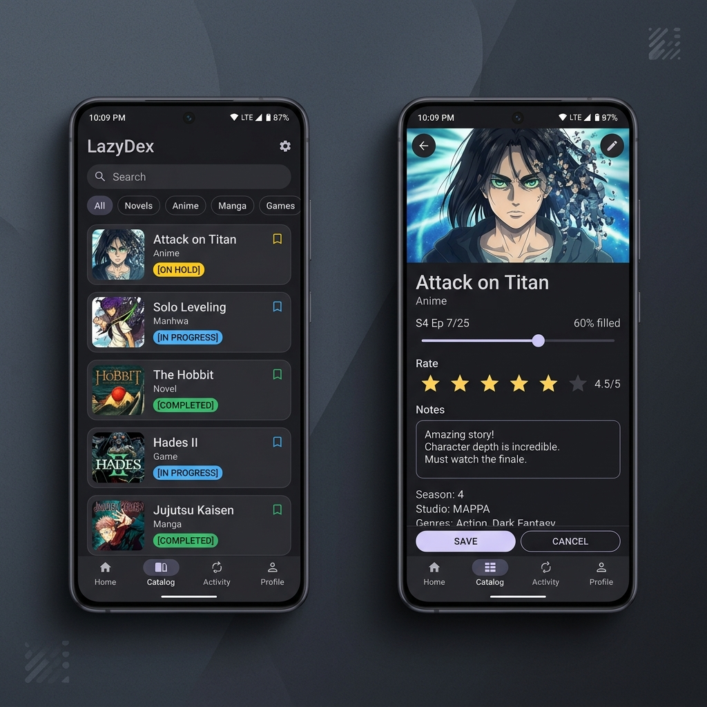

 

 <h1 align="center"> LazyDex </h1>

| Releases | Build & Test |
|----------|---------|
| 
    | 
  |

*Requires Android 8.0 or higher.*

## Download

*Requires Android 8.0 or higher.*

A free, open-source, local-only Android media tracker for keeping track of your progress across Novels, Anime, Manga, and Games. Privacy-first, with no accounts, no cloud dependencies, and no social tracking.

## Features

### LazyDex Unique Features:
- **Privacy-first / Local-only**: Your data never leaves your device. No cloud sync, no tracking, no social accounts, no telemetry.
- **Unified Add/Edit/Detail Screen**: An AniList-inspired unified view for viewing item details, updating consumption progress, adding new media, or editing existing items.
- **Smart URL Scraping**: Automatically populate title, cover image, and alternative titles by simply providing a URL from public websites.
- **Category-Adaptive Status Workflows**: Tailored workflows for each media type (Reading for Novels/Manga, Watching for Anime/TV/Movies, Playing for Games) transitioning seamlessly to Completed, On Hold, Dropped, or Plan to.
- **Progress Clamping & Safety**: Visual progress controls with error boundaries ensuring progress doesn't exceed the total items count. Auto-completes status when progress equals total.
- **Notion-Inspired Filtering & Sorting**: Clean, modal bottom sheet controls to sort and filter your library by Last Active, Title, Progress %, or Date Added.
- **Local Cover Manager**: Download cover images directly to local storage named after the unique item ID rather than loading from remote URLs, protecting against link rot and offline unavailability.
- **Alternative Titles List**: Flexible alternative title storage saved as JSON, with an interactive swap-to-main UI to update the primary catalog title.
- **WTR-LAB-Inspired Aesthetic Theme**: Modern material-3 dark theme by default, customizable AMOLED black mode, dynamic Monet color palettes, and category-distinct outline icons.
- **Robust Backup & Import**: Manually import/export to JSON files via Android's Storage Access Framework (SAF). Supports merging or safety-enforced overwriting (requires holding press for 5-10 seconds to confirm).
- **Auto-Backups**: Scheduled background backups utilizing WorkManager with custom SAF target folders and a 30-day retention cleanup policy.

  
Tech Stack & Architecture

#### Main frameworks and decisions behind LazyDex:

* **Language**: Kotlin
* **UI Framework**: Jetpack Compose + Material3 (supporting dynamic color themes)
* **Dependency Injection**: Koin DI (lightweight, rapid build compilation)
* **Local Database**: Room SQLite (with schema exports for easy migrations and reactive Flow updates)
* **Networking**: OkHttp 4.x (industry standard client)
* **HTML Parsing**: Jsoup (robust web scraping)
* **Image Loading**: Coil v3 (modern Compose-native, integrated with OkHttp)
* **Serialization**: kotlinx.serialization (compile-time safe, reflection-free JSON serialization)
* **Navigation**: Navigation Compose (type-safe Google navigation)
* **Architecture**: MVVM (Model-View-ViewModel) + Repository Pattern
* **State Management**: Kotlin Flow & StateFlow (lifecycle-aware reactive state streams)
* **Unit Testing**: JUnit 5 Jupiter + MockK + Turbine (for viewmodels, repositories, and scrapers)
* **UI Testing**: JUnit 4 ComposeTestRule running with JUnit5 runner bridge

## Issues, Feature Requests and Contributing

Pull requests are welcome. For major changes, please open an issue first to discuss what you would like to change.

Issues

1. **Before reporting a new issue, take a look at the open [issues](https://github.com/lazy2dev/lazydex/issues).**
2. If you are unsure, ask or search the issues list first.

Bugs

* Include version (Settings → About → Version)
  * If not latest, try updating, it may have already been resolved
* Include steps to reproduce (if not obvious from description)
* Include screenshot (if needed)
* If it could be device-dependent, try reproducing on another device (if possible)
* Don't group unrelated requests into one issue

Use the [issue forms](https://github.com/lazy2dev/lazydex/issues/new) to submit a bug.

Feature Requests

* Write a detailed issue, explaining what it should do or how.
* Include screenshot (if needed).

Contributing

We welcome all contributions! Please check the GitHub repository and make sure your code aligns with our project architecture (Koin, Room, MVVM, Jetpack Compose, JUnit 5).

### Credits

Thank you to all the people who have contributed!

### Disclaimer

LazyDex is a metadata tracker. It does not provide, host, or stream any content. All media progress and titles are user-managed.

## License

    Copyright 2026 LazyDex Contributors

    Licensed under the Apache License, Version 2.0 (the "License");
    you may not use this file except in compliance with the License.
    You may obtain a copy of the License at

    http://www.apache.org/licenses/LICENSE-2.0

    Unless required by applicable law or agreed to in writing, software
    distributed under the License is distributed on an "AS IS" BASIS,
    WITHOUT WARRANTIES OR CONDITIONS OF ANY KIND, either express or implied.
    See the License for the specific language governing permissions and
    limitations under the License.
